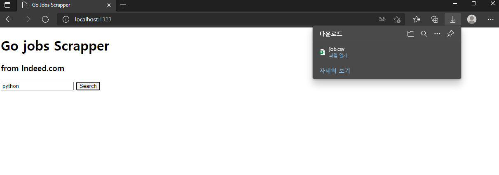

# This is a simple jobs scrapper with Go

## Requirements

you need to install echo to run the server

`$ go get github.com/labstack/echo`

## How it works

`$ go run main.go`

Go to `localhost:1323`

Input a keyword such as 'python' in the form and click the button.

Then, the scrapper works in the backend and you can download the file "jobs.csv" which contain many jobs that have to do with your keyword.

